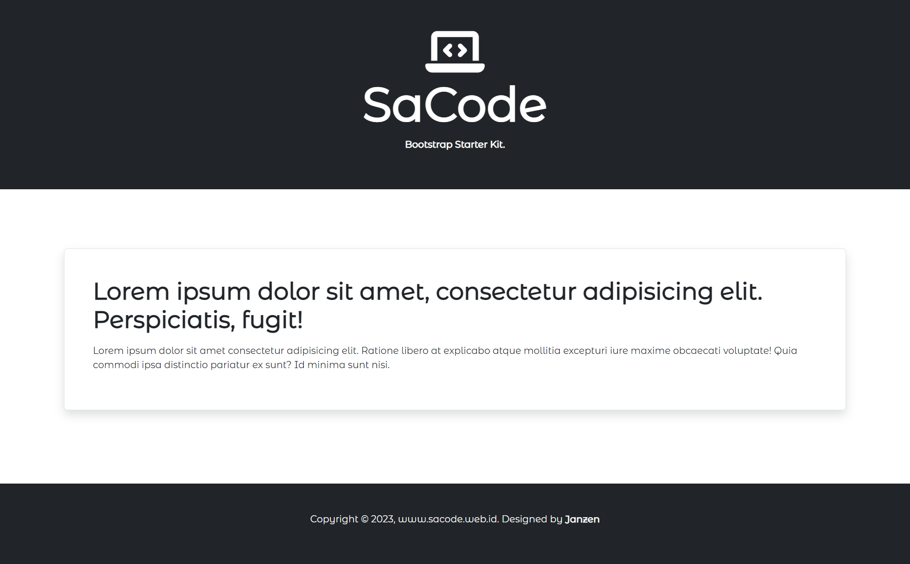

# Bootstrap 5.x Starter Kit Template

An initial web document htmll with Bootstrap 5.x, Font Awesome 6.x, Google Fonts API

## SCREENSHOTS



## <HEAD>

```
<head>
    <meta charset="UTF-8">
    <meta http-equiv="X-UA-Compatible" content="IE=edge">
    <meta name="viewport" content="width=device-width, initial-scale=1.0">
    <title>SaCode - Bootstrap Starter Kit</title>

    <!-- Bootstrap CSS -->
    <link href="https://cdn.jsdelivr.net/npm/bootstrap@5.3.0-alpha1/dist/css/bootstrap.min.css" rel="stylesheet"
        integrity="sha384-GLhlTQ8iRABdZLl6O3oVMWSktQOp6b7In1Zl3/Jr59b6EGGoI1aFkw7cmDA6j6gD" crossorigin="anonymous">

    <!-- Font Awesome Icons CDN -->
    <link rel="stylesheet" href="https://cdnjs.cloudflare.com/ajax/libs/font-awesome/6.3.0/css/all.min.css"
        integrity="sha512-SzlrxWUlpfuzQ+pcUCosxcglQRNAq/DZjVsC0lE40xsADsfeQoEypE+enwcOiGjk/bSuGGKHEyjSoQ1zVisanQ=="
        crossorigin="anonymous" referrerpolicy="no-referrer" />

    <!-- CUSTOME STYLES -->
    <style>
        /* import google font */
        @import url('https://fonts.googleapis.com/css?family=Montserrat Alternates');

        * {
            font-family: "Montserrat Alternates";
        }
    </style>


</head>
```

## <BODY> HEADER

```
<!-- HEADER START -->
    <header class="bg-dark py-5 mb-5">

        <!-- .container start -->
        <div class="container">

            <!-- .row start -->
            <div class="row">

                <!-- .col start -->
                <div class="col-12 text-white text-center fw-bold">

                    <i class="fa-solid fa-laptop-code display-1"></i> <!-- site logo -->

                    <h1 class="display-1 fw-bold">SaCode</h1> <!-- site name -->

                    <p class="h-3">Bootstrap Starter Kit.</p> <!-- site description -->

                </div>
                <!-- .col end -->

            </div>
            <!-- .row end -->

        </div>
        <!-- .container end -->

    </header>
    <!-- HEADER END -->
```

## <BODY> MAIN CONTENT

```
<!-- MAIN CONTENT START -->
    <section>

        <!-- .container start -->
        <div class="container" style="margin-top:100px;margin-bottom:100px;">

            <!-- .row start -->
            <div class="row">

                <!-- .col start -->
                <div class="col mb-4 border rounded shadow p-5">

                    <h1 class="mb-3 fw-bold">Lorem ipsum dolor sit amet, consectetur adipisicing elit. Perspiciatis, fugit!</h1>

                    <p class="mb-3">Lorem ipsum dolor sit amet consectetur adipisicing elit. Ratione libero at explicabo atque mollitia excepturi iure maxime obcaecati voluptate! Quia commodi ipsa distinctio pariatur ex sunt? Id minima sunt nisi.</p>

                </div>
                <!-- .col end -->

            </div>
            <!-- .row end -->

        </div>
        <!-- .container end -->

    </section>
    <!-- MAIN CONTENT END -->
```

## <BODY> FOOTER

```
<!-- FOOTER START -->
    <footer class="container-fluid bg-dark text-light py-5 mt-5 text-center">

        <p>
            Copyright &copy; 2023, www.sacode.web.id. Designed by <b>Janzen</b>
        </p>

    </footer>
    <!-- FOOTER END -->
```

## JAVASCRIPT FILES

```
    <!-- Bootstrap JavaScript -->
    <script src="https://cdn.jsdelivr.net/npm/bootstrap@5.3.0-alpha1/dist/js/bootstrap.bundle.min.js"
        integrity="sha384-w76AqPfDkMBDXo30jS1Sgez6pr3x5MlQ1ZAGC+nuZB+EYdgRZgiwxhTBTkF7CXvN"
        crossorigin="anonymous"></script>
```